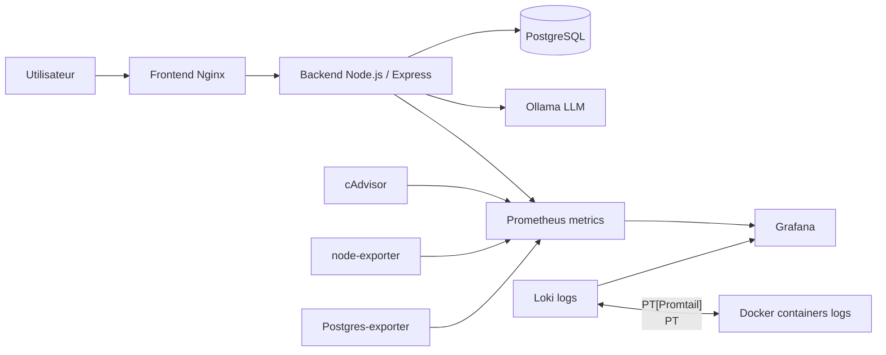

Voici ta version **complétée et corrigée proprement**, avec cohérence avec ton `docker-compose` (Ollama + monitoring + volumes + flux réels). J’ai aussi harmonisé quelques détails (modèle, logs, exporters, etc.).

---

# PPV Website - Documentation technique

Ce projet contient une petite application web avec :

* un **frontend** en HTML/CSS/JS servi par Nginx,
* un **backend** en Node.js / Express,
* une base **PostgreSQL**,
* **Ollama** pour faire tourner un chatbot en local.

Le projet contient aussi une partie **monitoring** avec **Prometheus**, **Grafana** et une stack de logs basée sur **Loki**.

Le projet est pensé pour être démarré facilement avec **Docker Compose**.

---

## Architecture



---

## Services Docker

* **frontend** : sert `index.html` et `page2.html` sur le port `3000` via Nginx.
* **backend** : expose l'API Node.js sur le port `4000`.
* **db** : héberge PostgreSQL sur le port `5432`.
* **ollama** : fournit le serveur LLM local sur le port `11434`.
* **ollama-pull** : télécharge automatiquement le modèle `llama3.2:1b`.
* **cadvisor** : surveille l’utilisation CPU/RAM des conteneurs Docker.
* **node-exporter** : expose les métriques système (CPU, RAM, disque).
* **postgres-exporter** : expose les métriques PostgreSQL.
* **prometheus** : collecte toutes les métriques sur le port `9090`.
* **grafana** : affiche les dashboards sur le port `3001`.
* **loki** : centralise les logs applicatifs et Docker.
* **promtail** : collecte les logs des conteneurs et les envoie à Loki.

---

## Réseau et communication

Tous les conteneurs sont sur le réseau Docker Compose.

Les communications internes utilisent les noms de services :

* `db` → PostgreSQL
* `ollama` → service IA
* `backend` → API Node.js
* `loki` → stockage des logs
* `prometheus` → métriques

### Flux principaux :

* Frontend → Backend : requêtes HTTP API
* Backend → DB : requêtes SQL PostgreSQL
* Backend → Ollama : génération IA
* Prometheus → exporters (cadvisor, node-exporter, postgres-exporter, backend)
* Promtail → Loki → Grafana

---

## Ports exposés

* Frontend : [http://localhost:3000](http://localhost:3000)
* Backend : [http://localhost:4000](http://localhost:4000)
* PostgreSQL : localhost:5432
* Ollama : [http://localhost:11434](http://localhost:11434)
* Prometheus : [http://localhost:9090](http://localhost:9090)
* Grafana : [http://localhost:3001](http://localhost:3001)
* cAdvisor : [http://localhost:8080](http://localhost:8080)
* Node Exporter : [http://localhost:9100](http://localhost:9100)
* Postgres Exporter : [http://localhost:9187](http://localhost:9187)
* Loki : [http://localhost:3100](http://localhost:3100)

---

## Persistance des données

Les volumes Docker assurent la persistance :

* `postgres_data` : données PostgreSQL
* `ollama_data` : modèles IA téléchargés
* `backend_node_modules` : dépendances Node.js
* `prometheus_data` : historique des métriques Prometheus
* `grafana_data` : dashboards et configurations Grafana
* `loki_data` : stockage des logs Loki
* `promtail_positions` : suivi de lecture des logs

---

## Initialisation de la base

Au démarrage, le fichier `db/init.sql` :

* crée la base `tasks_db`
* crée les tables nécessaires (ex: `users`, `tasks` selon le script)

---

## Variables d'environnement

Le projet utilise :

* `DB_HOST`
* `DB_PORT`
* `DB_USER`
* `DB_PASSWORD`
* `DB_NAME`
* `OLLAMA_BASE_URL`
* `OPENAI_API_KEY` (optionnel)
* `OPENAI_MODEL` (optionnel)
* `JWT_SECRET` (recommandé)
* `JWT_EXPIRES_IN` (optionnel)
* `PORT`

En local, elles peuvent être définies dans un fichier `.env`.

---

## Lancer le projet

```bash
docker compose up --build
```

---

## Fonctionnement

### Authentification

* `POST /api/login` : connexion utilisateur
* `POST /api/users` : création de compte
* Retourne un **JWT token**

---

### Base de données

* `GET /api/health` : vérifie la connexion PostgreSQL
* `GET /api/users` : liste des utilisateurs

---

### Chatbot (IA locale)

* `POST /api/ollama/chat` : envoie une requête au modèle IA
* Le backend transmet la requête à **Ollama**
* Réponse générée par le modèle `llama3.2:1b`

---

### Monitoring Grafana

Grafana affiche :

* état des conteneurs Docker (cAdvisor)
* CPU / RAM machine (node-exporter)
* métriques PostgreSQL
* performance backend Node.js
* logs applicatifs (Loki)

Accès :

```
http://localhost:3001
login: admin / admin
```

---

## Logs (observabilité)

* Docker logs → promtail
* promtail → Loki
* Loki → Grafana

Permet de :

* rechercher les logs en temps réel
* filtrer par service
* analyser les erreurs backend

---

## Organisation des fichiers

* `frontend/` : interface web statique
* `backend/` : API Node.js / Express
* `db/` : scripts SQL d’initialisation
* `monitoring/` : Prometheus, Grafana, Loki, Promtail
* `docker-compose.yml` : orchestration globale

---

## Remarque

Cette architecture est volontairement pédagogique et modulaire :

* un frontend simple
* un backend API
* une base PostgreSQL
* une IA locale avec Ollama
* une stack complète d’observabilité (metrics + logs)

Elle permet d’illustrer :

* les conteneurs Docker
* les réseaux internes
* la persistance via volumes
* le monitoring d’une application moderne
* l’intégration d’une IA locale dans un système distribué
