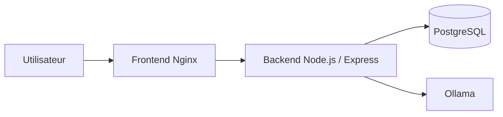

# PPV Website - Documentation technique

Ce projet contient une petite application web avec :
- un **frontend** en HTML/CSS/JS servi par Nginx,
- un **backend** en Node.js / Express,
- une base **PostgreSQL**,
- **Ollama** pour faire tourner le chatbot en local.

Le projet contient aussi une partie **monitoring** avec **Prometheus** et **Grafana**.

Le projet est pensé pour être démarré facilement avec **Docker Compose**.

## Architecture



### Services Docker

- **frontend** : sert `index.html` et `page2.html` sur le port `3000`.
- **backend** : expose l'API sur le port `4000`.
- **db** : héberge PostgreSQL sur le port `5432`.
- **ollama** : fournit le modèle IA sur le port `11434`.
- **ollama-pull** : télécharge automatiquement le modèle `llama3.2:1b`.
- **cadvisor** : remonte l'état et l'utilisation des conteneurs Docker.
- **postgres-exporter** : expose les métriques PostgreSQL.
- **prometheus** : collecte les métriques sur le port `9090`.
- **grafana** : affiche les tableaux de bord sur le port `3001`.

## Réseau et communication

Tous les conteneurs sont sur le même réseau Docker créé par Compose.
Les services se parlent avec leurs noms internes :
- `db` pour PostgreSQL,
- `ollama` pour le service IA,
- `backend` pour l'API.

Prometheus interroge aussi `cadvisor`, `postgres-exporter` et le backend Node.js.

## Ports exposés

- Frontend : `http://localhost:3000`
- Backend : `http://localhost:4000`
- PostgreSQL : `localhost:5432`
- Ollama : `http://localhost:11434`
- Prometheus : `http://localhost:9090`
- Grafana : `http://localhost:3001`

## Persistance des données

Deux volumes Docker sont utilisés :

- `postgres_data` : conserve les données PostgreSQL.
- `ollama_data` : conserve les modèles téléchargés par Ollama.
- `backend_node_modules` : évite de réinstaller les dépendances Node à chaque redémarrage.
- `prometheus_data` : conserve les données Prometheus.
- `grafana_data` : conserve les tableaux de bord Grafana.

## Initialisation de la base

Au démarrage, le fichier `db/init.sql` crée la table `users` si elle n'existe pas déjà.

## Variables d'environnement

Le projet utilise les variables suivantes :

- `DB_HOST`
- `DB_PORT`
- `DB_USER`
- `DB_PASSWORD`
- `DB_NAME`
- `OLLAMA_BASE_URL`
- `OPENAI_API_KEY` (optionnel)
- `OPENAI_MODEL` (optionnel)
- `JWT_SECRET` (recommandé)
- `JWT_EXPIRES_IN` (optionnel)
- `PORT`

En local, elles peuvent être mises dans le fichier `.env`.

## Lancer le projet

```bash
docker compose up --build
```

## Fonctionnement

### Authentification

- `POST /api/login` : connexion d'un utilisateur
- `POST /api/users` : création d'un compte
- Les réponses renvoient un token JWT

### Base de données

- `GET /api/health` : vérifie que PostgreSQL répond
- `GET /api/users` : liste les utilisateurs

### Chatbot

- `POST /api/ollama/chat` : envoie une question au modèle IA
- Le frontend récupère le token JWT et l'envoie au backend

### Monitoring Grafana

Le tableau de bord Grafana affiche :

- l'état des conteneurs Docker,
- l'utilisation CPU,
- l'utilisation mémoire,
- les métriques PostgreSQL,
- les performances générales de l'application.

Grafana est accessible sur `http://localhost:3001` avec `admin / admin`.

## Organisation des fichiers

- `frontend/` : pages HTML et assets statiques
- `backend/` : serveur Node.js
- `api/` : fonctions Vercel
- `db/` : script SQL d'initialisation
- `monitoring/` : configuration Prometheus et Grafana
- `docker-compose.yml` : orchestration complète

## Remarque

Cette version du projet est volontairement simple pour servir de support de cours Docker :
- un frontend statique,
- une API backend,
- une base PostgreSQL,
- un service IA local.

Le but est de montrer le fonctionnement des conteneurs, des volumes et des échanges entre services.
